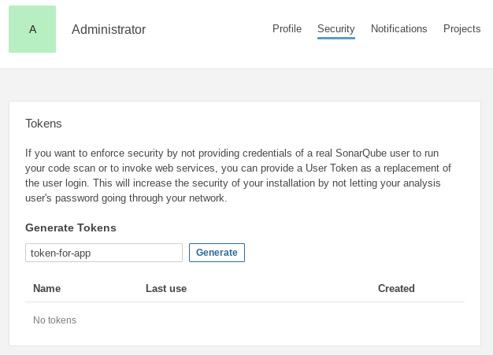

# Dockerfile template for Spring Boot

Optimized Dockerfile template for Spring Boot to be reduced size and secured.

## Description

### Multi-stage Docker build

```dockerfile
FROM gradle:6.5.1-jdk11 as java-build
  :
RUN gradle assemble
FROM gcr.io/distroless/java:11
  :
COPY --from=java-build
  :
ENTRYPOINT [ "java", ...]
```

### Clean separation between Dependencies and Application resources

Most frequently changing resources, usually the **class** and **static resources** in the application itself, to be layered after the more slowly changing resources

```dockerfile
COPY --from=java-build ${DEPENDENCY}/BOOT-INF/lib /app/lib
COPY --from=java-build ${DEPENDENCY}/META-INF /app/META-INF
COPY --from=java-build ${DEPENDENCY}/BOOT-INF/classes /app
```

### UseContainerSupport

- **-XX:InitialRAMPercentage**
    - Set initial JVM Heap size as a percentage of the total memory
- **-XX:MinRAMPercentage**
    - Set the minimal JVM Heap size as a percentage of the total memory
- **-XX:MaxRAMPercentage**
    - Set the maximum JVM Heap size as a percentage of the total memory

```dockerfile
ENV _JAVA_OPTIONS "-XX:MaxRAMPercentage=80 -XX:MinRAMPercentage=50"
```

#### Default settings

JVM will automatically detect the Control Group memory limit with the **UseContainerSupport** option.

```console
$ docker run -m 1GB openjdk:11.0.7-jre-slim java \
            -XX:+PrintFlagsFinal -version \
            | grep -E "UseContainerSupport | InitialRAMPercentage | MaxRAMPercentage | MinRAMPercentage"
WARNING: Your kernel does not support swap limit capabilities or the cgroup is not mounted. Memory limited without swap.
   double InitialRAMPercentage                     = 1.562500                                  {product} {default}
   double MaxRAMPercentage                         = 25.000000                                 {product} {default}
   double MinRAMPercentage                         = 50.000000                                 {product} {default}
     bool UseContainerSupport                      = true                                      {product} {default}
openjdk version "11.0.7" 2020-04-14
OpenJDK Runtime Environment 18.9 (build 11.0.7+10)
OpenJDK 64-Bit Server VM 18.9 (build 11.0.7+10, mixed mode)
```

#### Defaul Max Heap size

```console
$ docker run -m 1GB openjdk:11.0.7-jre-slim java -XshowSettings:vm -version

VM settings:
    Max. Heap Size (Estimated): 247.50M
    Using VM: OpenJDK 64-Bit Server VM
```

#### MaxRAMPed Max Heap size

```console
$ docker run -m 1GB openjdk:11.0.7-jre-slim java -XX:MaxRAMPercentage=80 -XX:MinRAMPercentage=50 -XshowSettings:vm -version

VM settings:
    Max. Heap Size (Estimated): 792.69M
    Using VM: OpenJDK 64-Bit Server VM
```

### "Distroless" Docker Images
"Distroless" images contain only your application and its runtime dependencies. They do not contain package managers, shells or any other programs you would expect to find in a standard Linux distribution.

```dockerfile
FROM gcr.io/distroless/java:11
  :
ENTRYPOINT [ "java", ...]
```


## Demo
### SonarQube

```console
$ docker run --rm -d --name sonarqube -p 9000:9000 sonarqube
```

Log in to [http://localhost:9000](http://localhost:9000) with System Administrator credentials (login=admin, password=admin).



- **build.gradle.kts***
```
plugins {
	id("org.sonarqube") version "3.0"
}
```

- **gradle.properties**

```properties
systemProp.sonar.host.url=http://localhost:9000
systemProp.sonar.login=<TOKEN>
```

```console
$ ./gradlew sonarqube
```

## Features

- feature:1
- feature:2

## Requirement

## Usage

## Installation

## Licence

Released under the [MIT license](https://gist.githubusercontent.com/shinyay/56e54ee4c0e22db8211e05e70a63247e/raw/34c6fdd50d54aa8e23560c296424aeb61599aa71/LICENSE)

## Author

[shinyay](https://github.com/shinyay)
